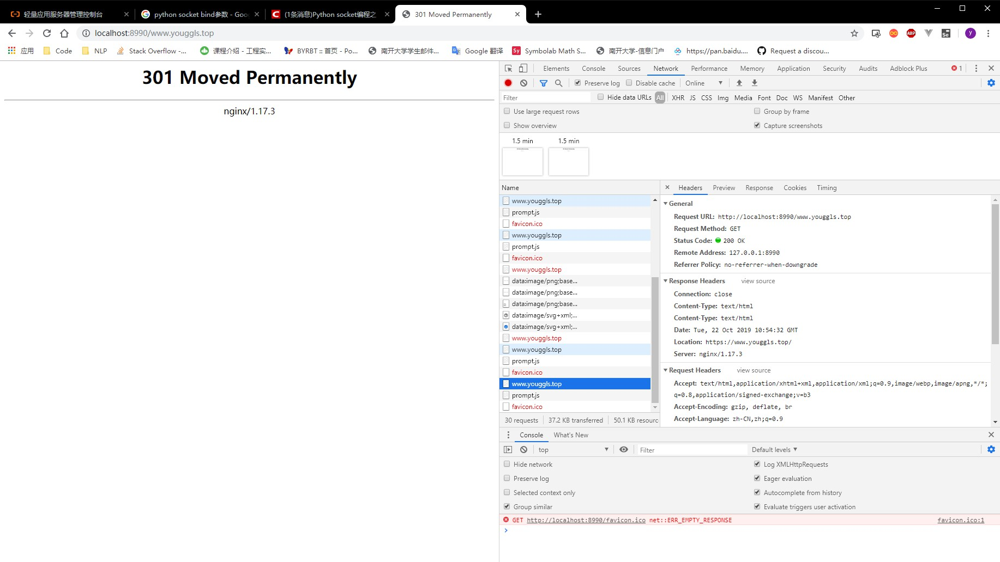

# 计算机网络实验：ProxyServer

姓名：李沛尧

学号：1712901

## 实验内容

实现一个简单的代理服务器

## 实验内容分析

1. 为了实现代理服务器的功能，在服务端需要处理用户的Http请求，并且对用户的请求返回相应的内容。

2. 为了提高访问速度，需要对请求的结果进行缓存，将请求结果缓存到本地文件。

3. 如果打开失败，需要返回404信息。

## 源代码

```py
from socket import *
import sys

if len(sys.argv) <= 1:
    print('Usage : "python ProxyServer.py server_ip"\n[server_ip : It is the IP Address Of Proxy Server')
    sys.exit(2)

# Create a server socket, bind it to a port and start listening
tcpSerSock = socket(AF_INET, SOCK_STREAM)
# Fill in start.
SERVER_IP = sys.argv[1]
PORT_NUM = 8990
tcpSerSock.bind((SERVER_IP, PORT_NUM))
tcpSerSock.listen(1)
# Fill in end.
while 1:
    # Strat receiving data from the client
    print('Ready to serve...')
    tcpCliSock, addr = tcpSerSock.accept()
    print('Received a connection from:', addr)
    message = tcpCliSock.recv(1024).decode().split('\r\n')[0]
    print(message)
    # Extract the filename from the given message
    print(message.split()[1])
    filename = message.split()[1].partition("/")[2]
    print(filename)
    fileExist = "false"
    filetouse = "/" + filename
    print(filetouse)
    try:
        # Check wether the file exist in the cache
        f = open(filetouse[1:], "r")
        outputdata = f.read()
        fileExist = "true"
        # ProxyServer finds a cache hit and generates a response message
        tcpCliSock.send("HTTP/1.1 200 OK\r\n".encode())
        tcpCliSock.send("Content-Type:text/html\r\n".encode())
        # Fill in start.
        for i in range(0, len(outputdata)):
            tcpCliSock.send(outputdata[i].encode())
        # Fill in end.
        print('Read from cache')
    # Error handling for file not found in cache
    except IOError:
        print('cache no set')
        if fileExist == "false":
            # Create a socket on the proxyserver
            c = socket(AF_INET, SOCK_STREAM)
            hostn = filename.replace("www.","",1)
            print(hostn)
            try:
                # Connect to the socket to port 80
                # Fill in start.
                c.connect((hostn, 80))
                # Fill in end.
                # Create a temporary file on this socket and ask port 80 for the file requested by the client
                request_message = "GET "+"http://" + filename + " HTTP/1.0\n\n"
                print(request_message)
                c.send(request_message.encode())
                # Read the response into buffer
                # Fill in start.
                response_data = c.recv(9999)
                print(response_data)
                # Fill in end.
                # Create a new file in the cache for the requested file.
                # Also send the response in the buffer to client socket and the corresponding file in the cache
                tmpFile = open("./" + filename, "wb")
                # Fill in start.
                tmpFile.write(response_data)
                tmpFile.close()
                # Fill in end.
            except:
                print("Illegal request")
        else:
            # HTTP response message for file not found
            # Fill in start.
            tcpCliSock.send('HTTP/1.1 404 Not Found\r\n'.encode())
            tcpCliSock.send('Content-type: text/html; charset=UTF-8\r\n\r\n'.encode())
            tcpCliSock.send('404 Not Found\r\n'.encode())
            # Fill in end.
    tcpCliSock.close()
```

## 实验结果截图

成功请求



如图，这是请求我的一个云服务器的示意图，该服务器部署了nginx。
